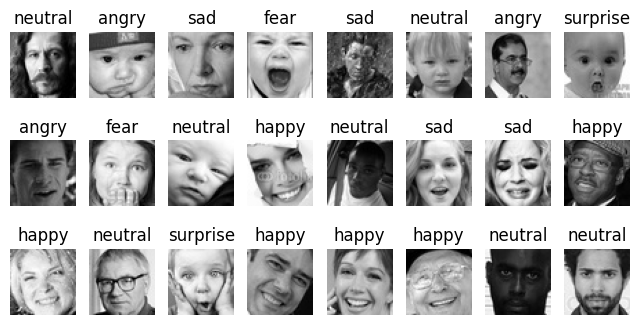

# facial-emotion-recognition

This projects aim to create a lightweight model to detect emotions. It compares different models performances on the fer-2013 dataset
- Authors : Grain Hamza, Blot--El Mazouzi Yanis, Dialo Amadou, Hayani Youssef
---

## Recognized Emotions : 
- Anger
- Happiness
- Fear
- Surprise
- Sadness
- Neutral

## Project Structure :
┌- data/
│  ├- train/
│  └- test/
│
├- src/
│  ├- config.py             # Hyperparameters
│  ├- dataset.py            # Defines functions to load datasets and set dataloaders.
│  ├- model.py              # Define different models.
│  ├- train.py              # With a given model and Hyperparameters, starts the training and testing.
│  ├- evaluate.py           # For a given model, evaluate it's training accuracy / loss, and confusion matrix.
│  ├- utils.py              # Functions
│  ├- experiment_img.py     # Inference on an image
│  └- experiment_live.py    # Inferences on a live video
│
│
├- models/
│  ├- __init__.py
│  ├- EmotionCNN.py
│  ├- ...
│
├- requirements.txt
└- README.md

## Dataset
- dataset : FER2013
- grayscale images
- Resolution : 48x48

The dataset is available on Kaggle. You can run scripts/download_datasets.py to download it.

Data augmentation (train set) :
- Random horizontal flip
- Random resized crop
- Random rotation

## Training
1. Set your hyperparameters in src/config.py
- BATCH_SIZE
- MANUAL_SEED
- HIDDEN_UNITS
- EPOCHS
- LEARNING_RATE
- INPUT_SHAPE (= 1)     # Do not change
- NUM_CLASSES (= 6)     # Do not change
2. Launch train.py
- wait until the end
- automatically save the model in /models
- metrics saved in assets

## Inference on a single image
1. on experiment_img.py
- define img_path with your image

- launch the script

